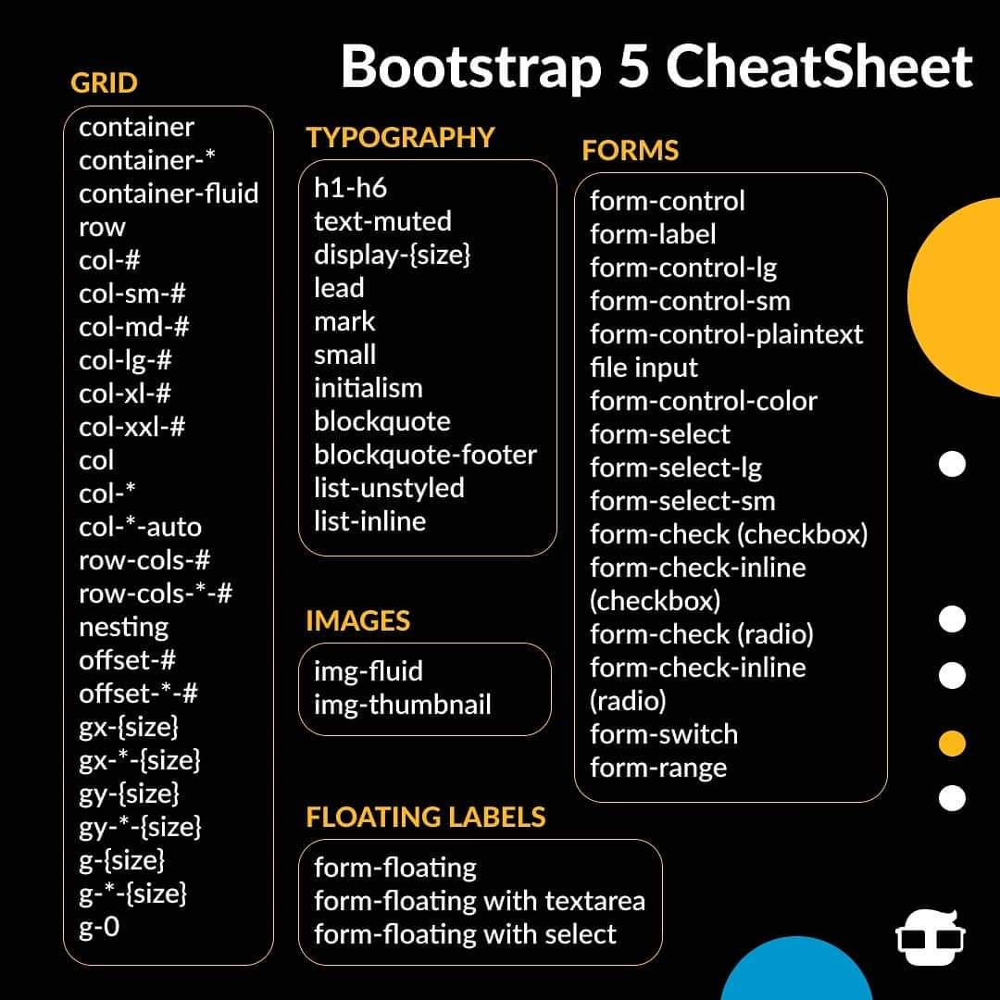
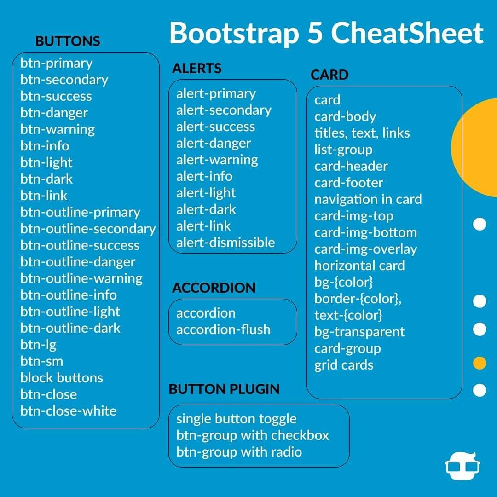
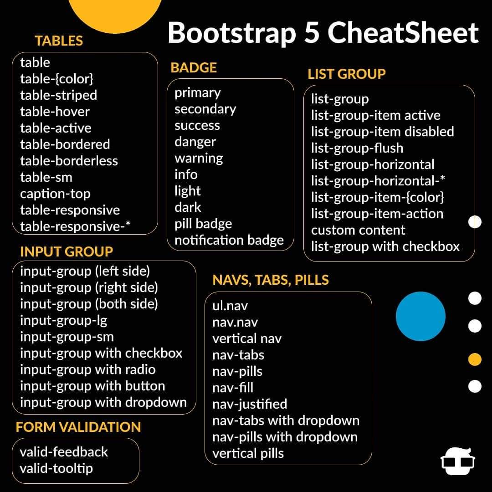
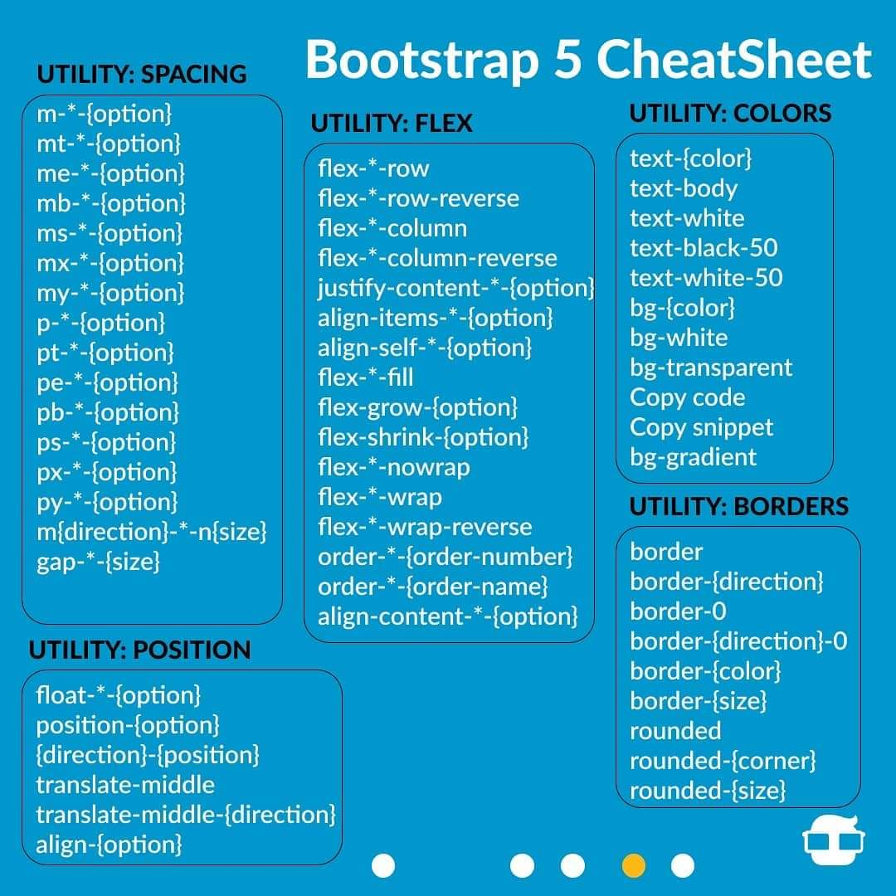
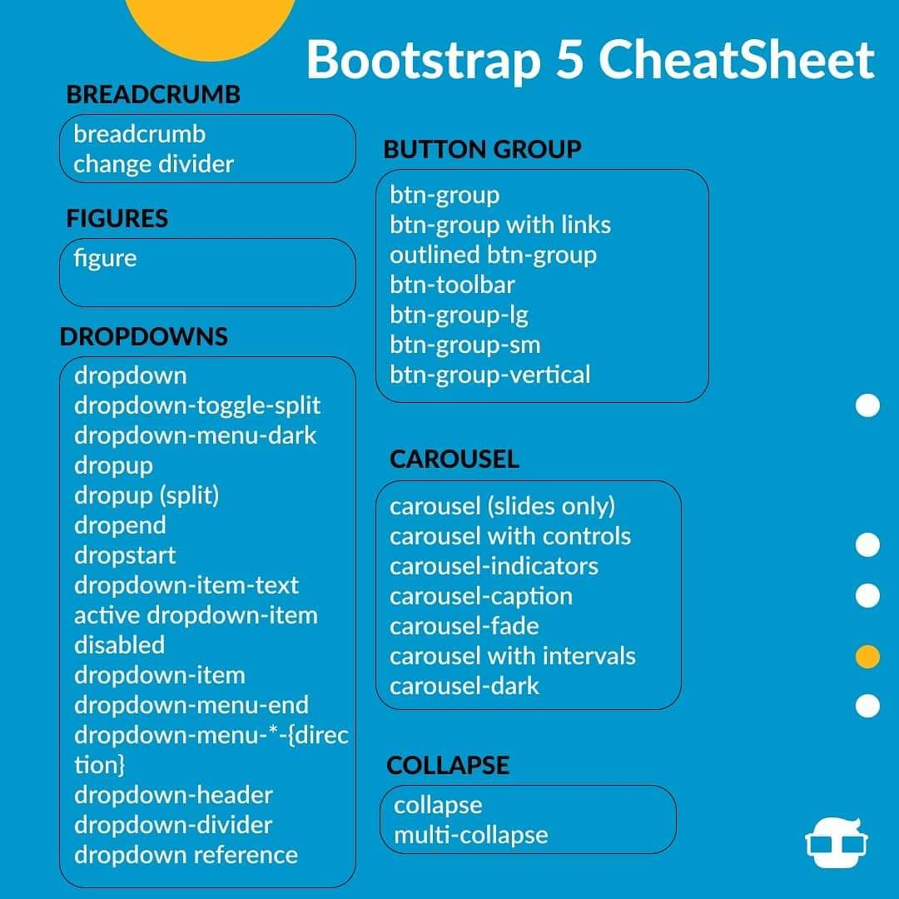
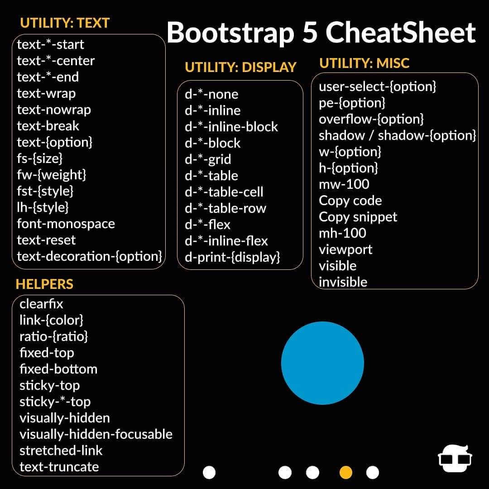
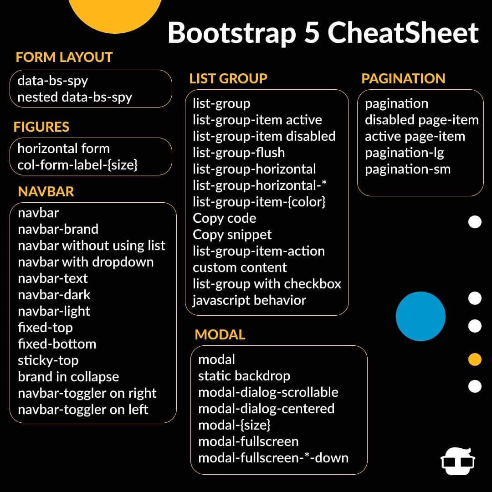
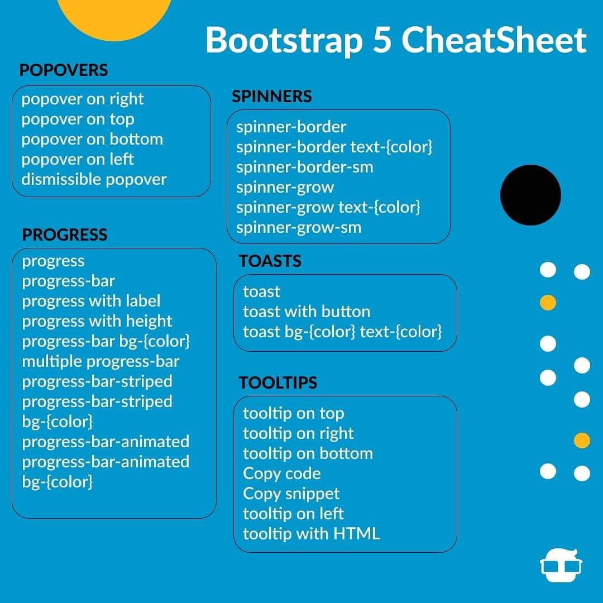

### What is Bootstrap :

- Bootstrap is a free front-end framework for faster and easier web development
- Bootstrap includes HTML and CSS based design templates for typography, forms, buttons, tables, navigation, modals, image carousels and many other, as well as optional JavaScript plugins
- Bootstrap also gives you the ability to easily create responsive designs

### Whu use Bootstrap:

- Increase development speed
- 100% Open Source Framework
- Assure Responsiveness
- Mobile-first approach: In Bootstrap 3, mobile-first styles are part of the core framework
- Browser compatibility: Bootstrap is compatible with all modern browsers

### Bootstrap History

- Bootstrap was developed by Mark Otto and Jacob Thornton at Twitter,
- Released as an open source product in August 2011 on GitHub.
- In June 2014 Bootstrap was the No.1 project on GitHub!

### Where to Get Bootstrap?

- There are two ways to start using Bootstrap on your own web site.

You can:

- Download Bootstrap from getbootstrap.com
- Include Bootstrap from a CDN

### Commands

```bash
#1.Container:

container --> The .container class provides a responsive fixed width container

container-fluid  --> The .container-fluid class provides a full width container, spanning the entire width of the viewport

container well --> is a background color example

#2.Bootstrap Grid System:

Bootstrap grid system allows up to 12 columns across the page.

span 1	span 1	span 1	span 1  	span 1	span 1	span 1	span 1	   span 1	span 1	span 1	span 1

            span 4	                         span 4	                                 span 4

            span 4	                                              span 8

                              span 6	                                   span 6

                                            span 12

#Grid Classes:
The Bootstrap grid system has four classes:

- xs (for phones - screens less than 768px wide)
- sm (for tablets - screens equal to or greater than 768px wide)
- md (for small laptops - screens equal to or greater than 992px wide)
- lg (for laptops and desktops - screens equal to or greater than 1200px wide)

#BS text & bg Color:

.text-muted,
.text-primary,
.text-success,
.text-info,
.text-warning,
.text-

.bg-primary,
.bg-success,
.bg-info,
.bg-warning


```

# Bootstap all Classes:

[Bootstraop all classes eamples](https://www.w3schools.com/bootstrap/bootstrap_ref_all_classes.asp)

# Bootstrap 5











